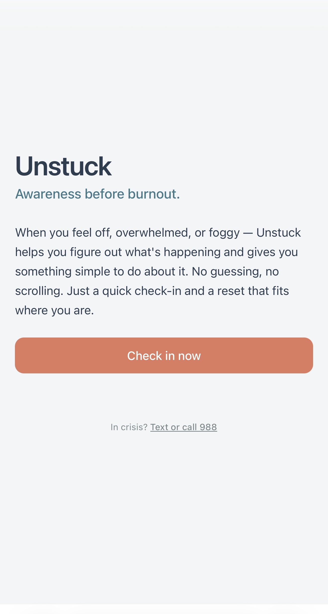
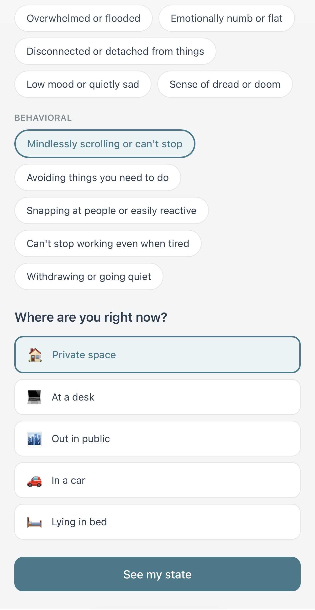
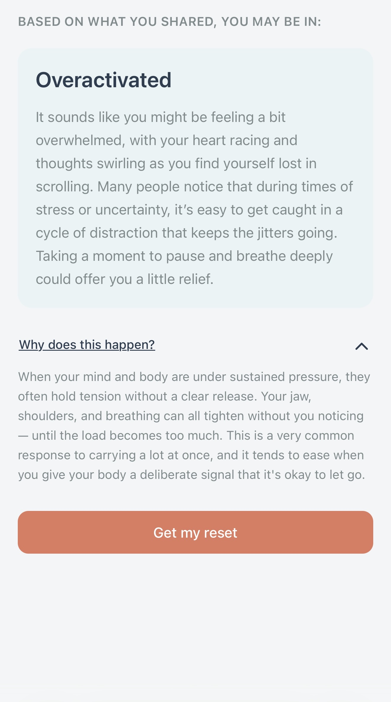
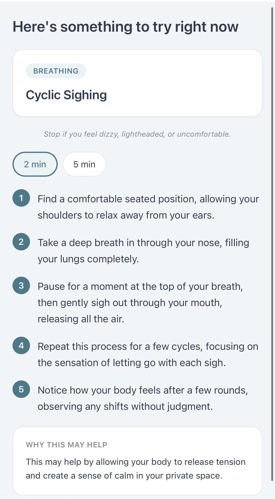
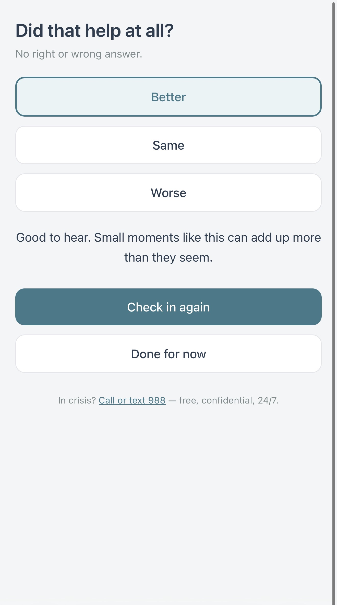

# Unstuck

**A brain-body awareness and reset tool — notice early signals of overload, identify your current state, and take practical action to shift it.**

---

## Live Demo

**[unstuck-4jakm0x6h-benzjosues-projects.vercel.app](https://unstuck-4jakm0x6h-benzjosues-projects.vercel.app/)**

---

## Why I Built This

I've been fascinated by the brain-body connection — specifically by how quickly a person's internal state can shift when the body receives different signals, and how poorly most people are equipped to recognize those shifts before they escalate.

Most people are told to manage their stress. Very few are taught how to recognize *what kind* of stress they're experiencing, or what to actually do about it in the moment that's appropriate for that specific state. The result: people push through until they crash, reach for generic advice that doesn't fit the situation, or stay stuck without understanding why.

I wanted to build something that closes that gap. Not a journaling app or a meditation library — something narrower and more immediately useful: a tool that helps you notice what's actually happening in your body right now, understand what state you might be in, and take one practical action to shift it.

Unstuck started as a hackathon concept — the first test of whether that idea was worth building. This is the completed version.

---

## The Problem

Stress and overload don't always feel the same. A racing mind, a heavy body, emotional flatness, that wired-but-can't-rest feeling — these are different internal states driven by different patterns of brain-body signaling, and they call for fundamentally different responses.

Most people can't name what they're experiencing in the moment. And without that awareness, they can't respond effectively.

Existing wellness tools often make this worse by jumping straight to solutions — breathing routines, meditation libraries, advice lists — without first helping the user understand *what state they're actually in*. Generic guidance doesn't account for context, state, or the person's specific moment. Awareness has to come before action.

---

## The Solution

A five-screen loop designed to move fast:

1. **Check in** — select signals you're noticing right now
2. **Get a state** — rule-based scoring identifies which of five states fits
3. **Read an explanation** — a short, warm, non-clinical description of what may be happening
4. **Follow a reset** — a technique chosen for your state and your current location
5. **Give feedback** — rate how you feel after; session complete

The verified demo run completed in **45 seconds** of active interaction.

---

## Core User Flow

```
Landing → Check-in → Result → Reset → Feedback
```

| Screen   | What happens                                                                       |
| -------- | ---------------------------------------------------------------------------------- |
| Landing  | Product overview, single CTA                                                       |
| Check-in | Select signals (26 options across 4 categories), pick context (5 options)          |
| Result   | Detected state label + AI-generated warm explanation                               |
| Reset    | Technique matched to state + context, step-by-step instructions, duration selector |
| Feedback | Outcome selection (Better / Same / Worse), personalized closing message            |

---

## Screenshots

> All screenshots are from the mobile-first production experience at 375px.

<p align="center">
  
</p>

*Landing screen on mobile: product promise, primary CTA, and persistent crisis resource link.*

<p align="center">
  
</p>

*Check-in screen: context selection and submission CTA, allowing the app to tailor the reset to the user's current environment.*

<p align="center">
  
</p>

*Result screen: detected state label, AI-generated explanation, and education toggle.*

<p align="center">
  
</p>

*Reset screen: context-aware technique, conditional breathwork safety note, duration selector, and numbered step list.*

<p align="center">
  
</p>

*Feedback screen: outcome selection, personalized closing message, and repeat check-in options.*

---

## From Hackathon Concept to Completed MVP

Unstuck was built at Hacklanta and intentionally positioned across two tracks: **Social Good** and **Startup**.

It fit Social Good because it aimed to help people recognize signs of overload earlier and access practical support before stress escalated — a real, underserved need with broad reach. It fit Startup because it was conceived as a product with genuine utility, a clear user problem, and a reason to exist beyond demo day.

The initial build validated the core loop and signal-to-state mapping. After the hackathon, I committed to completing it properly — writing a full product specification, defining a product constitution, and working through a structured six-milestone task breakdown before touching production code.

The result is an MVP that passes a formal Definition of Done checklist, has explicit safety guardrails, handles AI failures gracefully, and is deployed to production.

**Milestones:**

| #   | Milestone            | Focus                                                       |
| --- | -------------------- | ----------------------------------------------------------- |
| M0  | Foundation           | Project setup, Supabase schema, env configuration           |
| M1  | Logic + Content      | State detection, reset library, pre-written fallback copy   |
| M2  | Static UI            | All five screens navigable with placeholder data            |
| M3  | First Vertical Slice | Real API calls, DB writes, route guards active              |
| M4  | AI Integration       | OpenAI wired to both routes, fallback explicitly verified   |
| M5  | Polish + Quality     | Animations, error states, mobile QA, TypeScript strict pass |
| M6  | Final Gate + Deploy  | Definition of Done checklist, Vercel deploy, timed demo     |

---

## What This MVP Was Designed to Prove

The MVP is intentionally narrower than the broader Unstuck vision.

For this first version, I constrained the product to a single tight loop: check in, identify a state, get a reset, give feedback. No accounts, no session history, no longitudinal tracking. The product constitution was deliberately strict — every rule pointed toward staying focused, safe, and shippable rather than exploring the full problem space.

That constraint was the right call. Shipping a complete end-to-end product — with real state detection, real AI personalization, real database writes, explicit fallback paths, and a demo loop that completes in 45 seconds — proved the core idea works and that it was worth building beyond the hackathon.

But the tighter scope also clarified what the next version needs to do better.

The deeper Unstuck vision isn't a check-in loop. It's a brain-body awareness and regulation product — one that helps users not just get a reset, but understand *why* their body responded the way it did, recognize what states they tend toward under pressure, and build practical, usable knowledge about their own patterns over time.

The next version would move closer to that vision: deepening the educational layer on the Result screen, improving the explanatory specificity of reset instructions, surfacing patterns across sessions, and developing the brain-body framing into something that actively teaches users to self-regulate — not just in one session, but over many.

The MVP proves the core loop works. The next version makes the loop matter more.

---

## Key Features

- **Rule-based state detection** — 26 signals, weighted scoring across 5 states; deterministic and debuggable
- **AI-personalized copy** — OpenAI generates the explanation and reset instructions; pre-written fallback activates automatically on any failure
- **Context-aware resets** — technique selection accounts for where the user is (desk, public, car, bed, private space)
- **Route guards** — `/result`, `/reset`, and `/feedback` redirect to `/` if accessed without completing prior steps
- **Anonymous sessions** — UUID stored in `localStorage`; no account required
- **Silent AI fallback** — if OpenAI is unavailable, the app continues with pre-written content; the user sees no error
- **Crisis resource** — 988 link present on Landing and Feedback screens, always visible and tappable
- **Breathwork safety gate** — safety note displayed before any breathwork technique
- **Mobile-first** — designed and tested at 375px; all interactions reachable with one thumb

---

## Tech Stack

| Layer      | Technology               |
| ---------- | ------------------------ |
| Framework  | Next.js 14 (App Router)  |
| Language   | TypeScript (strict mode) |
| Styling    | Tailwind CSS             |
| Components | shadcn/ui                |
| Animation  | Framer Motion            |
| Database   | Supabase (PostgreSQL)    |
| AI         | OpenAI gpt-4o-mini       |
| Deployment | Vercel                   |

---

## Architecture Overview

```
app/
├── page.tsx                  # Landing
├── checkin/page.tsx          # Check-in form
├── result/page.tsx           # State + explanation
├── reset/page.tsx            # Technique + steps
├── feedback/page.tsx         # Outcome capture
└── api/
    ├── analyze/route.ts      # State detection + explanation + DB write
    ├── reset/route.ts        # Technique selection + reset copy + DB write
    └── feedback/route.ts     # Outcome write

lib/
├── state-detection/
│   ├── signals.ts            # 26 signals with per-state weights
│   └── logic.ts              # detectState() — pure rule-based scoring
├── content/
│   ├── resets.ts             # Reset library: 25 state × context slots
│   └── fallbacks.ts          # Pre-written explanations and closing messages
├── openai/
│   ├── client.ts             # Server-only OpenAI client
│   └── prompts.ts            # All prompt templates in one place
├── supabase/
│   ├── server.ts             # Service role client (API routes only)
│   └── client.ts             # Anon client (browser)
└── context/session.tsx       # React context for cross-screen session state
```

**Key architectural decisions:**

- **AI never detects state.** `detectState()` is pure rule-based scoring. AI receives the already-detected label and personalizes the copy. This keeps detection reliable, testable, and independent of API availability.
- **All AI and DB calls in API routes.** Client components never touch OpenAI or Supabase directly.
- **Session state in React context.** Data flows across screens via `CheckinSessionProvider`. No redundant fetching between screens.
- **Fallback-first design.** Every AI call has a pre-written fallback that activates silently on timeout, error, or malformed response.

---

## AI Usage

**What AI does:**

- Generates the personalized 2–3 sentence explanation on the Result screen (`gpt-4o-mini`, max 200 tokens)
- Generates personalized step-by-step instructions and a "why this may help" sentence for the Reset screen (`gpt-4o-mini`, max 400 tokens, returns structured JSON)

**What AI does not do:**

- Detect or classify the user's state — always rule-based scoring
- Choose the technique — always a lookup against the pre-written reset library
- Operate without a safety net — every call has an explicit fallback

**Prompt design principles:**

- Warm, non-clinical language
- Hedged framing ("may", "often", "can") — never certainty claims
- No clinical terminology (HRV, cortisol, sympathetic nervous system)
- No shame or blame language
- Specific to this user's moment — not copy-pasteable into any wellness app

All prompt templates live in `lib/openai/prompts.ts`. No prompt logic is scattered across routes.

---

## Database / Persistence

Four Supabase tables, connected via soft references through `session_id`:

| Table           | Purpose                                               |
| --------------- | ----------------------------------------------------- |
| `checkins`      | Selected signals, context, session ID                 |
| `state_results` | Detected state, explanation, `ai_used` flag           |
| `reset_plans`   | Technique, steps, why copy, selected duration         |
| `feedback`      | Outcome (better / same / worse), linked to reset plan |

Sessions are anonymous — identified by a UUID generated on first visit and persisted in `localStorage`. No sign-up required.

The service role key is used only in API routes (server-side). The anon key is scoped to the browser. Secrets never reach the client.

---

## Safety + Fallback Design

**AI fallback:**
Both `/api/analyze` and `/api/reset` wrap OpenAI calls in try/catch with a 15-second timeout. Any failure — network error, timeout, empty response, or malformed JSON — activates the pre-written fallback silently. The user never encounters an error from AI unavailability.

**Feedback writes:**
`/api/feedback` logs DB errors server-side but always returns 200. A failed feedback write never blocks the user from seeing their closing message.

**Safety gates:**

- Breathwork techniques display a safety note before instructions: _"Stop if you feel dizzy, lightheaded, or uncomfortable."_
- 988 crisis link is present on Landing and Feedback screens — always visible, never behind a toggle.

---

## Development Process

This project was built spec-first. Before writing production code, I authored:

- A **product constitution** defining what the app is, what it must never become, and a decision hierarchy for resolving tradeoffs
- A **full MVP specification** covering states, signals, techniques, tone rules, and database schema
- A **75-task implementation plan** across six milestones, with explicit checkpoints that had to pass before the next milestone could begin

I used Claude (Anthropic) as a development partner throughout — writing code, reviewing architecture decisions, and catching edge cases. The distinction that matters: I drove the product direction, defined the constraints, validated each milestone manually, debugged failures, and made every architectural decision. AI accelerated execution within a structure I designed.

**Decisions that required real judgment:**

- Choosing rule-based detection over AI detection — for reliability and debuggability
- Designing the fallback chain to be invisible to users
- Making feedback DB failures non-blocking by design
- Writing prompt guardrails that prevent clinical, overconfident, or generic copy

---

## Running Locally

```bash
git clone https://github.com/Benzjosue/Unstuck
cd Unstuck
npm install
```

Create a `.env.local` file in the project root:

```env
OPENAI_API_KEY=
NEXT_PUBLIC_SUPABASE_URL=
NEXT_PUBLIC_SUPABASE_ANON_KEY=
SUPABASE_SERVICE_ROLE_KEY=
```

Then:

```bash
npm run dev
```

Open [http://localhost:3000](http://localhost:3000). All four variables are required. To deploy your own instance, push to GitHub, import at [vercel.com/new](https://vercel.com/new), and add the four environment variables under Project Settings. `npm run build` passes with zero errors and zero TypeScript warnings.

---

## What I Learned

**On product:** Defining what a product is _not_ is as important as defining what it is. The constitution forced decisions I would have otherwise deferred — and those decisions made every subsequent implementation choice cleaner.

**On AI integration:** Keeping AI out of state detection entirely was the right call. Rule-based scoring is deterministic, debuggable, and testable. AI adds warmth to the output; it doesn't drive the logic. That separation is what makes the system reliable.

**On fallbacks:** Building the fallback path before the AI path forced me to think clearly about what the app needs to guarantee. The fallback isn't a degraded experience — it's a complete one.

**On spec-driven development:** Writing a 75-task breakdown before coding felt like overhead at first. In practice, it eliminated the most common source of scope creep: building the wrong thing next. Every task had a clear done condition.

**On TypeScript:** Strict mode from the start, with all types flowing from a single `lib/types.ts`, kept the codebase consistent and made refactors safe. Zero type errors at the final gate.

---

## Future Improvements

These are grounded in the broader product vision — the direction a second version would move toward.

- **Deeper educational layer** — more specific explanations of what's happening internally and why a given state tends to arise; less generic, more useful for building genuine self-awareness
- **Brain-body pattern tracking** — session history that helps users recognize which states they tend toward, what tends to trigger them, and what consistently helps
- **Richer reset instructions** — explanations of why a specific technique may work for a specific state, not just what to do
- **User accounts** — optional sign-up to persist history across devices
- **Technique rotation** — avoid recommending the same reset in consecutive sessions
- **Onboarding flow** — brief first-visit context that sets up the brain-body framing for new users
- **Push notifications** — optional check-in reminders at user-defined times

---

## Resume / Interview Talking Points

- Built a production consumer wellness web app end-to-end: spec, architecture, implementation, and deployment
- Designed a hybrid AI/rule-based architecture — deterministic scoring for reliability, AI for personalization — with explicit fallback paths covering all failure modes
- Wrote a product constitution before writing production code; used it as the tiebreaker for every architectural tradeoff
- Implemented anonymous session persistence, cross-screen React context, input-validated API routes, route guards, and full DB write coverage across four Supabase tables
- Applied spec-driven development: 75 tasks across 6 milestones with explicit checkpoints that gated each phase
- Zero TypeScript errors in strict mode at final delivery; verified demo loop runs in 45 seconds

---

## Closing

Unstuck is a project I built because I wanted something like it to exist — and because I believe people deserve better tools for understanding what their own body is telling them.

The version shipped here is an intentionally tight MVP. The constraint I cared most about was written into the constitution from the start:

> _"I feel off → I open Unstuck → I feel better. If the app can't deliver that in under three minutes, it has failed."_

The MVP delivers on that. The verified demo run: 45 seconds.

But the question that originally motivated this project is bigger: *What if people could learn to recognize their own brain-body patterns well enough to respond before stress escalates — not just once, but as a genuine skill?* The MVP is the first proof point toward that answer. What gets built next is the more interesting problem.
